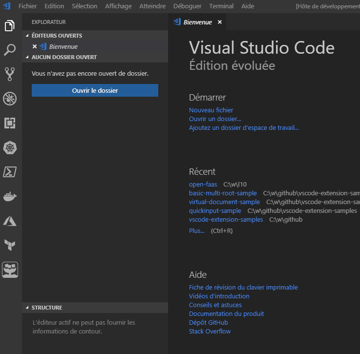

# open-faas explorer

This extension allows the visualization of currently available Open-FaaS functions on different gateways.

## Features

- See currently available functions in the Open-FaaS explorer tree-view

## Known Issues

Complex properties of functions are not yet properly displayed

## Release Notes

This is the first release, please submit issues for defects and improvements.

### 1.1.0

Initial release

-----------------------------------------------------------------------------------------------------------
