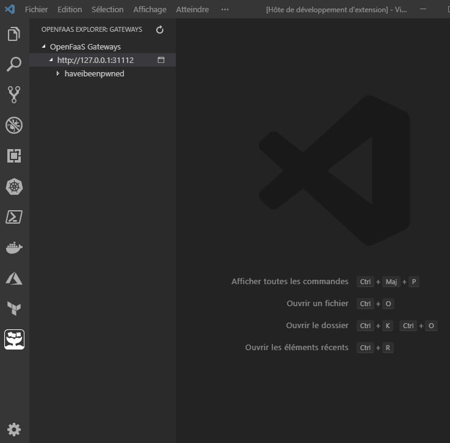

# open-faas explorer

This extension allows the visualization of currently available Open-FaaS functions on different gateways.

## Features

- See currently available functions in the Open-FaaS explorer tree-view

## Known Issues

Complex properties of functions are not yet properly displayed

## Release Notes

### 1.1.4

- Minor refactoring
- It's now possible to open gateway portal page from the explorer tree.

### 1.1.2

Refactor project structure, upgrade vulnerable dependencies. Properly implement CI/CD.

### 1.1.0

Initial release

-----------------------------------------------------------------------------------------------------------
